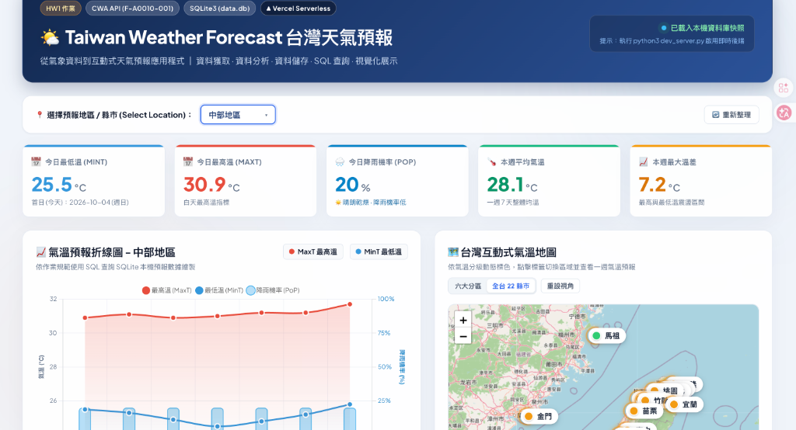
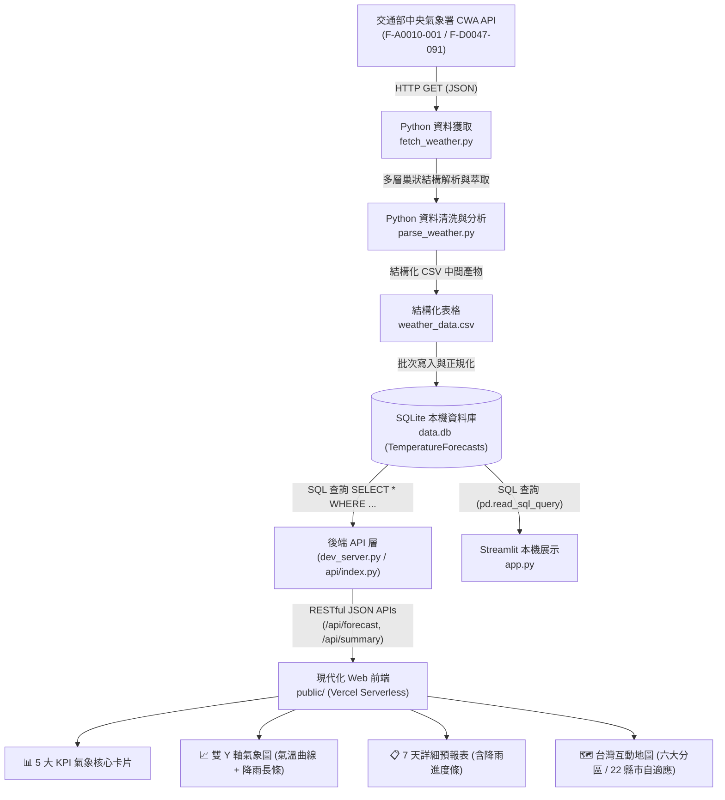

# 🌤️ Taiwan Weather Forecast 台灣天氣預報應用程式

> **從氣象資料到現代化互動式天氣預報 Web 應用程式**  
> 整合 **CWA API × JSON × Python × SQLite × Vercel Serverless × Leaflet × Chart.js × Streamlit**，實現全自動資料管線：資料獲取、解析清洗、資料庫持久化、SQL 條件查詢與高質感雙軸視覺化展示。

[](https://hw1-seven-inky.vercel.app/)
[](https://github.com/czk001167-hash/0930)
[](https://www.python.org/)
[](https://www.sqlite.org/)
[](https://leafletjs.com/)

---

🚀 **線上即時展示 (Live Demo)**：[https://hw1-seven-inky.vercel.app/](https://hw1-seven-inky.vercel.app/)  
📦 **GitHub 專案儲存庫**：[https://github.com/czk001167-hash/0930](https://github.com/czk001167-hash/0930)



---

## 📌 專案簡介 (Overview)

本專案串接交通部中央氣象署（CWA）開放資料平台 API，獲取全台灣各縣市與六大地理分區（北部、中部、南部、東北部、東部、東南部）之一週天氣預報。利用 Python 進行資料工程管線分析，將清洗後的氣溫與降雨機率數據寫入 SQLite 資料庫（`data.db`）。

前端打造了極具現代美感的互動式儀表板，支援 **全台 22 縣市與六大分區** 自由切換、以今日為基準的 **動態 7 天滾動預報**、氣溫與降雨機率 **雙 Y 軸專業氣象圖表**，以及具備自適應視野的 **台灣互動式氣溫地圖**。

### 🎯 核心實作亮點
- [x] **Open Data API 串接**：對接中央氣象署 API（支援 `F-A0010-001` 與 `F-D0047-091` 聚合備援）
- [x] **多維度氣象資料處理**：完整解析每日最低溫（`MinT`）、最高溫（`MaxT`）與降雨機率（`PoP`）
- [x] **動態滾動 7 天日期**：每次開啟永遠以「今天 (第 1 天)」為預報起點，日期隨真實時間自動更新
- [x] **SQLite 資料庫正規化**：嚴格遵守作業架構規範，前端僅透過 SQL 條件式查詢後端資料庫
- [x] **台灣互動地圖視覺化**：
  - 獨創懸浮白色膠囊標籤（Pill Badge）與黃金脈衝定位光圈（`.marker-pin-ring`）
  - 依作業規範之平均氣溫自動四級分色（藍 `<20°C`、綠 `20-25°C`、黃 `25-30°C`、紅 `>30°C`）
  - 支援 **「六大分區」** ↔ **「全台 22 縣市」** 一鍵無縫切換，並以 `fitTaiwanBounds` 自適應聚焦
  - 採用全球免金鑰、無浮水印之 OpenStreetMap 高畫質圖資
- [x] **全方位「降雨機率 (PoP)」整合**：
  - 頂部 5 大核心指標卡（包含今日降雨機率與出門帶傘建議）
  - 詳細數據表內嵌彩色等級徽章與 **動態長條進度條（Progress Bar）**
  - Chart.js **雙 Y 軸複合圖表**（左軸氣溫雙曲線 + 右軸半透明降雨長條柱）
- [x] **雙架構全端部署**：
  - **Vercel Serverless Edition**：零外部相依標準庫 API + 純原生現代化響應式前端
  - **Streamlit Local Edition (`app.py`)**：完整相容作業模組 1 ~ 5 原始評分規範

---

## 🔄 系統架構與資料管線 (Data Pipeline)



---

## 🧩 作業評分模組對照 (Homework Modules)

### 模組 1：取得 CWA API 資料 (`fetch_weather.py`，配分 20%)
- **目標**：呼叫中央氣象署 API 取得預報資料，並將回傳結果儲存為 `cwa_weather_raw.json`。
- **涵蓋範圍**：六大地理分區（北部、中部、南部、東北部、東部、東南部）及全台 22 縣市。
- **具備自動備援機制**：當舊版端點維護時，自動切換至現行 `F-D0047-091` 端點聚合並維持標準輸出。

### 模組 2：分析 JSON，提取氣溫與降雨資料 (`parse_weather.py`，配分 20%)
- **目標**：解析階層式 JSON，精準提取每日最低溫（`MinT`）、最高溫（`MaxT`）與降雨機率（`PoP`）。
- **JSON 層級架構**：
  ```text
  records
  └── locations
      └── location[] (各縣市 / 六大分區)
          └── weatherElement[] (天氣要素)
              └── time[] (預報時間區段)
                  ├── elementName: MinT (最低溫)
                  ├── elementName: MaxT (最高溫)
                  └── elementName: PoP (降雨機率)
  ```
- **輸出結構化表格**：儲存為標準中間產物 `weather_data.csv`。

### 模組 3：存入 SQLite 資料庫 (`database.py`，配分 20%)
- **資料表結構** (`data.db` -> `TemperatureForecasts`)：
  ```sql
  CREATE TABLE TemperatureForecasts (
      id INTEGER PRIMARY KEY AUTOINCREMENT,
      regionName TEXT NOT NULL,
      dataDate TEXT NOT NULL,
      minT REAL NOT NULL,
      maxT REAL NOT NULL,
      pop INTEGER DEFAULT 20,
      UNIQUE(regionName, dataDate) ON CONFLICT REPLACE
  );
  ```
- **驗證查詢項目**：
  1. 列出所有地區：`SELECT DISTINCT regionName FROM TemperatureForecasts;`
  2. 查詢中部地區一週預報：`SELECT id, regionName, dataDate, minT, maxT, pop FROM TemperatureForecasts WHERE regionName = '中部地區' ORDER BY dataDate ASC;`

### 模組 4：互動式 Web 預報應用程式 (`app.py` & `public/`，配分 20%)
- **地區選單**：支援標準下拉式選單切換全台 22 縣市與六大分區。
- **SQL 查詢機制**：嚴格透過 SQL 語法從本機 `data.db` 查詢指定地區資料。
- **視覺化折線圖**：
  - 🔴 紅線：每日最高溫（`MaxT`）
  - 🔵 藍線：每日最低溫（`MinT`）
  - 🌧️ 降雨柱狀圖：每日降雨機率（`PoP`）
- **詳細數據表格**：條列未來一週 7 天日期、最低溫、最高溫、降雨機率進度條、當日溫差與氣溫區間等級。

### 模組 5：台灣地圖視覺化 (`Leaflet` & `Folium`，配分 20%)
- **依平均氣溫之標準四級分色**：
  - 🔵 **< 20°C**：低溫（深海藍 `#2b83ba`）
  - 🟢 **20°C ~ 25°C**：舒適（翠綠色 `#2ecc71`）
  - 🟡 **25°C ~ 30°C**：溫暖（暖陽黃 `#f39c12`）
  - 🔴 **> 30°C**：炎熱（珊瑚紅 `#e74c3c`）
- **互動卡片**：點擊地圖膠囊標籤或圓點，即時彈出當區一週均溫、高低溫與平均降雨機率卡片。

---

## 📂 專案檔案結構 (Project Structure)

```text
HW1-Taiwan-weather-forecst/
├── api/
│   └── index.py            # Vercel Serverless 後端 API 入口 (相容標準庫)
├── public/
│   ├── index.html          # 現代化 Web 前端主頁 (支援動態滾動預報)
│   ├── style.css           # 玻璃擬態樣式表、響應式排版與地圖標籤動效
│   ├── app.js              # 前端邏輯 (Leaflet 地圖控制、Chart.js 繪圖)
│   └── fallback_data.json  # 離線/靜態備援資料快照 (全台 28 點位)
├── assets/
│   └── demo.png            # 系統即時展示畫面截圖 (README 引用)
├── cwa_weather_raw.json    # 模組 1 產生之中央氣象署原始 JSON 資料
├── weather_data.csv        # 模組 2 產生之中間結構化 CSV 資料表
├── data.db                 # 模組 3 產生之 SQLite 本機持久化資料庫
├── fetch_weather.py        # 模組 1 執行腳本：擷取 CWA 氣象資料
├── parse_weather.py        # 模組 2 執行腳本：解析並抽取氣溫降雨資料
├── database.py             # 模組 3 執行腳本：建立 SQLite 並執行驗證查詢
├── dev_server.py           # 本地一鍵開發伺服器 (模擬 Vercel Serverless)
├── app.py                  # 模組 4 & 5：Streamlit 互動式 Web App
├── vercel.json             # Vercel 雲端部署重寫與路由設定
├── requirements.txt        # Python 相依套件清單 (支援 Streamlit)
├── .env                    # 環境變數設定檔 (存放個人 CWA API Key)
├── .gitignore              # Git 版本控制忽略設定
└── README.md               # 專案完整技術與作業規格說明文件
```

---

## 🚀 快速開始與本地執行 (Quick Start)

### 方式 A：啟動現代化 Web 伺服器 (推薦，與線上版完全相同)

無須安裝任何龐大的第三方套件，僅需 Python 內建標準庫即可一鍵啟動：

```bash
# 啟動本地開發伺服器 (支援靜態檔案與 /api/* 端點)
python3 dev_server.py
```
啟動後打開瀏覽器訪問：👉 **`http://127.0.0.1:3000`**

---

### 方式 B：啟動 Streamlit 作業標準版 (`app.py`)

```bash
# 1. 建立虛擬環境 (建議)
python3 -m venv venv
source venv/bin/activate  # Windows 請執行 .\venv\Scripts\activate

# 2. 安裝必要套件
pip install -r requirements.txt

# 3. 執行資料工程管線 (重新抓取並更新資料庫)
python3 fetch_weather.py
python3 parse_weather.py
python3 database.py

# 4. 啟動 Streamlit 應用程式
streamlit run app.py
```

---

## ☁️ 雲端部署 (Vercel Deployment)

本專案已完整設定 `vercel.json`，支援直接連結 GitHub 倉庫進行持續部署 (CI/CD)：
1. 前端靜態檔案由 Vercel Edge Network 全球 CDN 加速（`public/`）。
2. 後端 API 由 Serverless Function 自動驅動（`api/index.py` 查詢 `data.db`）。
3. 官方線上部署展示：[https://hw1-seven-inky.vercel.app/](https://hw1-seven-inky.vercel.app/)

---

## 🔒 資料安全與作業準則提醒
1. **API Key 保護**：API Key 應透過環境變數管理，嚴禁將個人金鑰明文寫入程式碼公開推送。
2. **架構規範遵循**：前端 Web App **嚴格透過 SQL 語法向 SQLite 資料庫查詢數據**，嚴禁在客戶端直接暴露並調用中央氣象署 API。
3. **資料正確性**：每日數據均經過資料型態檢驗與小數點正規化，確保一週 7 天完整呈現。

---

*程式探索天氣 · 資料看見台灣 ｜ Built with Passion, Python & Modern Web Technologies.*
